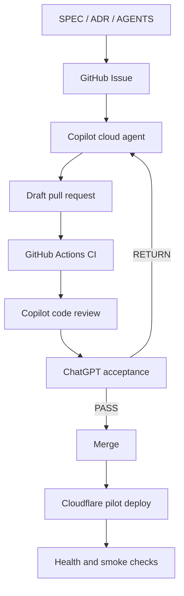
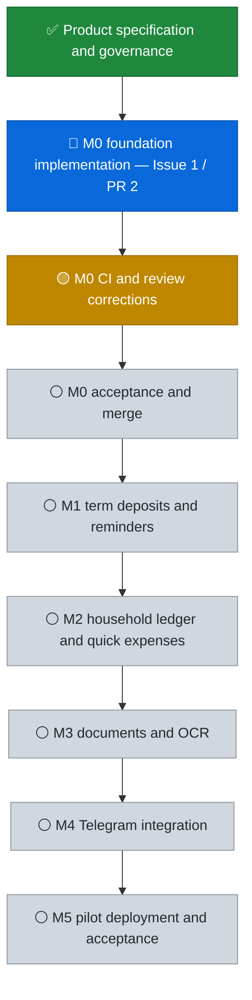

# BankManage Project Status

> Last verified: 2026-08-31 UTC.  
> Live work is tracked by GitHub Issues, pull requests, checks and GitHub Projects. This file is the owner-facing visual snapshot; it does not replace `SPEC.md`, ADRs or acceptance evidence.

## Current snapshot

| Item | Verified status |
| --- | --- |
| Authoritative branch | `main` |
| Current milestone | **M0 — GitHub/Cloudflare foundation** |
| Active task | [Issue #1 — M0 scaffold](https://github.com/jhackuy/bankmanage/issues/1) |
| Active delivery | [PR #2 — Copilot M0 implementation](https://github.com/jhackuy/bankmanage/pull/2), Draft, 4 commits / 44 changed files at verification time |
| CI | **Attention required** — latest `CI` run concluded `action_required` |
| Review | **Changes recommended** by Copilot; corrections and re-review required |
| Accepted milestones | **0 / 6** — M0 is active; M1–M5 remain pending |
| Merge state | **Forbidden until CI, Copilot review and ChatGPT acceptance pass** |

## Development workflow

## Project progress

## Status meaning

- **Done** requires merged code plus accepted evidence; an open Issue, a commit count or an Agent message is not completion.
- **Active** means implementation is currently advancing.
- **Attention required** means the work can continue but cannot merge.
- **Pending** means the milestone has not entered accepted implementation.
- Update this snapshot only when Issue, PR, CI, review, acceptance or deployment state materially changes.
